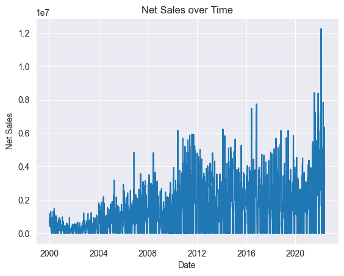

# Code Review: Spark

#### By Drew White

#### Code Review - Demonstrating the use of Apache Spark

## Technologies Used


* Python
* Apache Spark
* Pandas
* Matplotlib
* Google BigQuery

</br>

## Description:
### Set Up the Data
* Read `coffee.csv` file into a Spark DataFrame.
* All the columns are floats except for the 'Date' and 'Currency' columns.

### Columns from Aggregate Functions
* Add column `daily_diff` to the DataFrame where the values are the difference between 'Open' and 'Close'.

* Add column `high_low` to the DataFrame where the values are the difference between 'High' and 'Low'.

* Add column`volume_100` to the DataFrame where the values are 'True' if the volume for that day was 100 or above, and otherwise 'False'.

* Add column `abs_diff` that contains the absolute values of the numbers in that column.

* Compute a column `net_sales` which is the average of opening, high, low, and closing cost times the volume.

### Stats
* Find the average of the values in the column that has the absolute values of the difference between 'Open' and 'Close'.

* Get the count of values where the 'Volume' was less than 100.

* Find the average 'Open' value.

* Get the highest 'High' value.

### Write File
* Save your DataFrame (including the four added columns) to /data as a parquet file. Exclude the /data directory from Git.


_Net Sales:_  
 


<br>

## Setup/Installation Requirements

* Clone by inputting following into terminal: 
  ```bash
  git clone https://github.com/Drewrwhite/data_week_13.git
  ```
* Navigate to directory:
  ```bash
  cd <directory>
  ```
* Create a virtual environment:
  ```bash
  python3.7 -m venv venv
  ```
* Activate virtual environment:
  ```bash
  source venv/bin/activate
  ```
* Install requirements:
  ```bash
  pip install -r requirements.txt
  ```
* Open directory in VSCode:
  ```bash
  code .
  ```
* Navigate to `data`:
  ```bash
  cd data
  ```
* Run get_data.sh:
  ```bash
  ./get_data.sh
  ```

</br>

## Known Bugs

* No known bugs

<br>

## License

[MIT](./license.txt)

_If you find any issues, please reach out at: **d.white0002@gmail.com**._

Copyright (c) _2023_ _Drew White_

</br>
